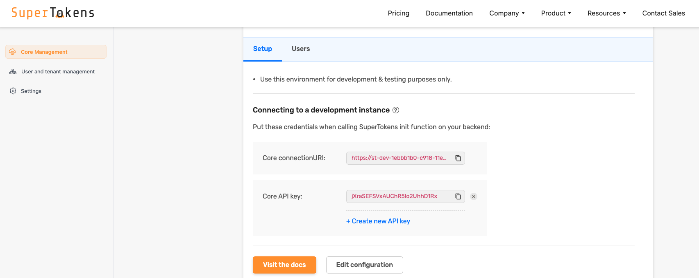
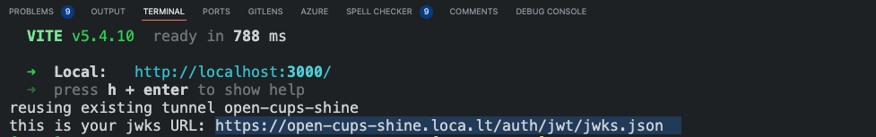
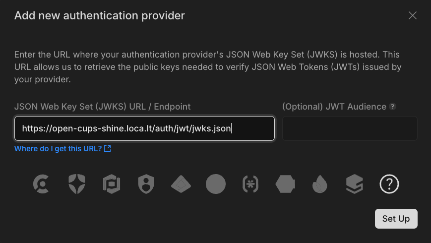
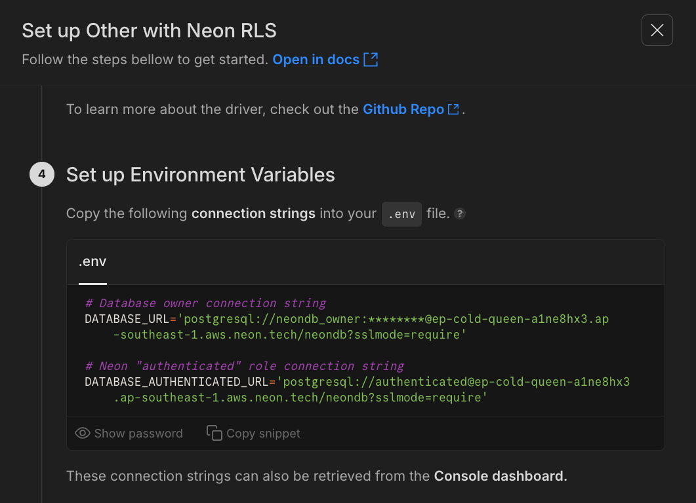
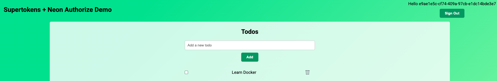
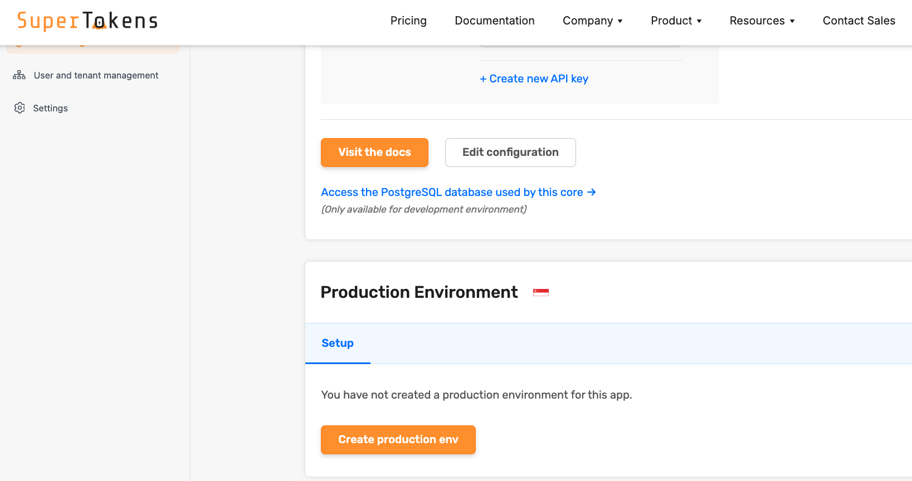

<picture>
  <source media="(prefers-color-scheme: dark)" srcset="https://neon.com/brand/neon-logo-dark-color.svg">
  <source media="(prefers-color-scheme: light)" srcset="https://neon.com/brand/neon-logo-light-color.svg">
  
</picture>

# Neon RLS + Supertokens Example (SQL from the Backend)

A demo showcasing the integration of Supertokens for authentication and Neon RLS for secure backend data access with Drizzle ORM in a NestJS and SolidJS application. This example demonstrates how to use Neon RLS to enforce row-level security policies when querying your Neon database from the backend.

## The Stack

- NestJS backend for API development
- SolidJS frontend for a reactive user interface
- User authentication powered by Supertokens
- Row-level security using Neon RLS
- Database interactions with Drizzle ORM

## Prerequisites

- [Neon](https://neon.tech) account with a new project
- [Supertokens](https://supertokens.com) account
- Node.js installed locally

> **Important**: This setup uses `localtunnel` to expose your local backend API for Neon RLS configuration. **Be aware that your backend will be publicly accessible as long as the tunnel is active.** Remember to shut down the tunnel when you are finished.

## Local Development Setup

### Supertokens Setup

1. Sign up or log in to your [Supertokens dashboard](https://supertokens.com/dashboard-saas).
2. Create a new project.
3. Obtain your **Core URI** and **API Key** from the Supertokens dashboard.
   

### Local Installation

1. Clone the repository:

   ```bash
   git clone https://github.com/neondatabase-labs/supertokens-nestjs-solidjs-drizzle-neon-rls
   cd supertokens-nestjs-solidjs-drizzle-neon-rls
   ```

2. Install dependencies for the frontend, backend and localtunnel:

   ```bash
   npm i && cd backend && npm i && cd ../frontend && npm i && cd ..
   ```

3. Create `.env` file in the `backend` directory with the following variables:

   ```bash
   cp backend/.env.example backend/.env
   ```

   ```env
   SUPERTOKENS_URI=<YOUR_SUPERTOKENS_CORE_URI>
   SUPERTOKENS_API_KEY=<YOUR_SUPERTOKENS_CORE_API_KEY>
   DATABASE_URL="" # Leave this empty for now
   DATABASE_AUTHENTICATED_URL="" # Leave this empty for now
   ```

4. Start the services:

   ```bash
   npm run start
   ```

   This command will start the frontend, backend, and the `localtunnel` service.

5. **Copy JWKS URL**

   - Once the `npm run start` command is running, a `localtunnel` URL will be generated and displayed in your terminal, along with the Supertokens JWKS URL.
     
   - Copy this JWKS URL.
   - Return to the "RLS" section in your Neon Console (Project Settings).
   - Paste the copied JWKS URL into the "JWKS URL" field when adding a new authentication provider
     
   - Follow the steps in the UI to setup the roles for Neon RLS. You should ignore the schema related steps if you're following this guide.
   - Note down the connection strings for both the **`neondb_owner` role** and the **`authenticated, passwordless` role**. You'll need both. The `neondb_owner` role has full privileges and is used for migrations, while the `authenticated` role will be used by the application and will have its access restricted by RLS.
     

6. Stop the services by pressing `Ctrl + C` in the terminal.

7. Update the `.env` file in the `backend` directory to include the connection strings:

   ```env
   SUPERTOKENS_URI=<YOUR_SUPERTOKENS_CORE_URI>
   SUPERTOKENS_API_KEY=<YOUR_SUPERTOKENS_CORE_API_KEY>
   DATABASE_URL=<YOUR_NEON_DATABASE_URL_WITH_PASSWORD>
   DATABASE_AUTHENTICATED_URL=<YOUR_NEON_DATABASE_AUTHENTICATED_URL>
   ```

8. **Apply Database Migrations:**

   ```bash
   cd backend
   npm run drizzle:migrate
   cd ..
   ```

9. Start the services again

   ```bash
   npm run start
   ```

   This command will start the frontend, backend, and the `localtunnel` service.

10. Open your browser to `http://localhost:3000` to see the application running.
    

## Important: Production Setup

> **Note**: Before deploying to production, ensure you transition your Supertokens project from development to live in the Supertokens dashboard. This will involve setting up the required DNS records for your domain. Update your environment variables in both the frontend and backend with your production Supertokens configuration.



## Learn More

- [Neon RLS Tutorial](https://neon.tech/docs/guides/neon-rls-tutorial)
- [Simplify RLS with Drizzle](https://neon.tech/docs/guides/neon-rls-drizzle)
- [Supertokens Documentation](https://supertokens.com/docs)

## Authors

- [Brian Holt](https://github.com/btholt)

## Contributing

Contributions are welcome! Please feel free to submit a Pull Request.
